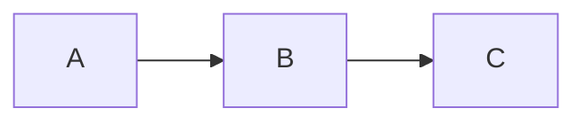

# Obsidian Vault Management

## Purpose

This skill provides expert guidance for working with Obsidian vaults, enabling effective knowledge management through proper syntax usage, organizational best practices, and workflow automation. It covers Obsidian Flavored Markdown (OFM), modern organization methodologies, task management workflows, and integration with Claude Code.

## When to Use This Skill

Use this skill when:
- Working with Obsidian notes and needing to understand OFM syntax
- Organizing or restructuring an Obsidian vault
- Setting up daily/weekly task management workflows
- Creating templates for notes, projects, or reviews
- Performing vault maintenance (finding broken links, orphaned notes, etc.)
- Helping users implement knowledge management best practices
- Integrating Obsidian with automation tools or Claude Code

## Obsidian Flavored Markdown (OFM)

### Key Syntax Differences

Obsidian extends standard Markdown with wiki-inspired features:

**Wikilinks (Internal Linking):**
- `[[Note Name]]` - Link to another note
- `[[Note Name|Display Text]]` - Custom display text
- `[[Note#Heading]]` - Link to specific heading
- `[[Note^block-id]]` - Link to specific block
- Add `^block-id` at end of any line to create referenceable blocks

**Embeds (Transclusion):**
- `![[Note]]` - Embed entire note
- `![[Note#Heading]]` - Embed from heading onwards
- `![[Note^block-id]]` - Embed specific block
- `![[Image.jpg]]` - Embed media files

**Callouts:**
```markdown
> [!note] Optional Title
> Content here
```

Types: note, tip, info, todo, warning, danger, error, bug, example, abstract, success, question, failure, important, quote

Collapsible: `[!tip]+` (expanded) or `[!tip]-` (collapsed)

**Tags:**
- `#tag` - Basic tag
- `#parent/child/grandchild` - Nested hierarchy

**Comments:**
- `%% Hidden comment %%` - Obsidian-only, not portable

**Highlights:**
- `==highlighted text==` - Obsidian-specific

**Properties/Frontmatter:**
```yaml
---
title: Note Title
date: 2025-11-12
tags: [tag1, tag2]
status: active
---
```

**Math (LaTeX):**
- Inline: `$E = mc^2$`
- Display: `$$equation$$`

**Diagrams (Mermaid):**
````markdown

````

**Dataview Queries (if plugin installed):**
````markdown
```dataview
TABLE rating, date
FROM #books
SORT rating DESC
```
````

For complete syntax details, refer to `references/ofm-syntax.md`.

## Organization Best Practices

### Recommended Folder Structures

**ACE Framework (Recommended):**
```
Atlas/          # Knowledge maps, ideas, reference materials
Calendar/       # Daily notes, periodic notes, time-based entries
Efforts/        # Projects, goals, active work
```

**FINVA System (Workflow-based):**
```
Fleeting/       # Quick rough notes (weekly review)
In Progress/    # Projects needing work
Notes/          # Permanent completed notes
Views/          # MOCs and organizational notes
Archives/       # Old projects
```

**Zettelkasten (Research-focused):**
```
Fleeting/       # Temporary captures
Permanent/      # Atomic evergreen notes
```

### Core Principles

1. Use minimal folders (3-7 top-level max)
2. Organize by note TYPE, not TOPIC - let links connect topics
3. Create MOCs (Maps of Content) as navigation hubs
4. Design for worst-day usability - system must work when tired
5. Let structure emerge organically rather than pre-planning everything

### Maps of Content (MOCs)

MOCs are index notes that link to related notes:

```markdown
# Topic Name

## Overview
Brief description

## Subtopic 1
- [[Note 1]]
- [[Note 2]]

## Subtopic 2
- [[Note 3]]
- [[Note 4]]
```

Create MOCs when:
- Experiencing "mental squeeze point" (juggling too many related notes)
- Topic has 5+ related notes
- Need navigation hub for an area

For detailed organization strategies, refer to `references/organization-guide.md`.

## Daily/Weekly Task Workflows

### Essential Plugins

- **Daily Notes** (Core) - Creates daily notes
- **Templater** (Community) - Advanced templates
- **Tasks** (Community) - Task management
- **Dataview** (Community) - Query and display data
- **Day Planner** (Community) - Time blocking

### Templates

Daily note template available at `assets/templates/daily-note.md`
Weekly review template available at `assets/templates/weekly-review.md`
Project template available at `assets/templates/project.md`

### Task Syntax (Tasks Plugin)

```markdown
- [ ] Basic task
- [ ] Task with due date =Å 2025-11-15
- [ ] High priority task ë
- [ ] Recurring task = every week
```

### Time Blocking

Use Day Planner plugin with 24-hour format:

```markdown
## Today's Schedule

- [ ] 07:00 Morning Routine
- [ ] 08:00 Deep Work - Project X
- [ ] 10:00 Team Meeting
```

For complete workflow details, refer to `references/task-workflows.md`.

## Vault Maintenance Workflows

### Health Check Workflow

When performing vault health checks:

1. **Find broken links:**
   - Read all notes and extract `[[wikilinks]]`
   - Check if target files exist
   - Report broken links with source locations

2. **Find orphaned notes:**
   - Analyze all notes for incoming/outgoing links
   - Report notes with no connections

3. **Check frontmatter completeness:**
   - Verify all notes have required metadata
   - Report missing fields

4. **Find duplicate titles:**
   - Compare note filenames and titles
   - Flag potential duplicates

5. **Identify stubs:**
   - Find notes with less than 100 words
   - Suggest expansion or archival

Use `scripts/vault_health.py` for automated health checks.

### Note Organization Workflow

When organizing notes:

1. **Analyze content:**
   - Read note content and existing metadata
   - Identify main topics and themes

2. **Suggest improvements:**
   - Appropriate tags based on content
   - Related notes that should be linked
   - Folder location if misplaced
   - Missing frontmatter fields

3. **Get approval:**
   - Show proposed changes
   - Ask for confirmation
   - Apply changes systematically

### Batch Operations Safety

When performing batch operations:

1. **Always preview changes first:**
   - Show before/after
   - List affected files
   - Get explicit approval

2. **Process in batches:**
   - Handle 50 files at a time for large vaults
   - Provide progress updates

3. **Preserve Obsidian syntax:**
   - Don't break wikilinks when renaming
   - Keep embeds functional
   - Maintain block references

4. **Backup reminder:**
   - Remind user to backup before major changes
   - Suggest git commit if using version control

## Quality Standards

### When Creating/Editing Notes

Always ensure:

1. **Frontmatter is present and complete:**
   ```yaml
   ---
   title: Note Title
   created: YYYY-MM-DD
   tags: [relevant, tags]
   ---
   ```

2. **First heading matches title:**
   ```markdown
   # Note Title
   ```

3. **Wikilinks are properly formatted:**
   - Use `[[Note Name]]` not `[Note Name](note-name.md)`
   - Check that linked notes exist
   - Suggest creating missing notes

4. **Appropriate callouts for key info:**
   ```markdown
   > [!important]
   > Critical information here
   ```

5. **Related notes are linked:**
   - Add "Related" or "See Also" section
   - Link to parent MOC
   - Link to related projects

6. **Tags follow convention:**
   - Use nested tags: `#category/subcategory`
   - Be consistent with existing tags
   - Don't create redundant tags

## Claude Code Integration

### MCP (Model Context Protocol) Setup

For AI-assisted vault management:

1. Install "Local REST API" community plugin in Obsidian
2. Generate API key in Obsidian settings
3. Install MCP server: `npx -y @smithery/cli install mcp-obsidian --client claude`
4. Restart Claude Desktop

### Vault Context File

Recommend users create `CLAUDE.md` in vault root with:
- Vault structure description
- Naming conventions
- Common workflows
- Quality standards

Example vault context file available at `assets/templates/CLAUDE.md`

### Available MCP Operations

- `obsidian_read_note` - Read content and metadata
- `obsidian_global_search` - Search entire vault
- `obsidian_update_note` - Append, prepend, or overwrite
- `obsidian_manage_frontmatter` - Get/set YAML metadata
- `obsidian_manage_tags` - Add/remove tags

## Recommended Tools

### Export & Publishing

- **obsidian-export** (Rust CLI) - Convert vault to standard markdown
- **Quartz v4** - Static site generator for Obsidian
- **Obsidian Digital Garden** - Netlify publishing plugin

### Terminal Access

- **obsidian-cli** (Yakitrak/Go) - CLI for vault operations

### Automation

- **obsidian-metadata** (Python) - Bulk metadata operations
- **Templater** - Advanced templates with JavaScript
- **Linter** - Automated formatting

### Sync & Backup

- **Obsidian Git** - Version control (desktop)
- **Remotely Save** - Multi-cloud sync (mobile-friendly)

For complete tooling reference, see `references/tools-and-automation.md`.

## Best Practices Summary

1. **Start simple** - 3-7 top-level folders, evolve organically
2. **Use links liberally** - Connect related ideas naturally
3. **Create MOCs** - Navigation hubs for major topics
4. **Maintain daily notes** - Capture everything daily
5. **Weekly reviews** - Regular reflection and cleanup
6. **Atomic notes** - One main idea per note
7. **Use templates** - Consistency and efficiency
8. **Automate repetitive tasks** - Plugins and scripts
9. **Backup regularly** - Git or cloud sync
10. **Design for retrieval** - Optimize for finding, not filing

## Performance Optimization

### For Large Vaults

1. **Use specific paths** - Don't search entire vault unnecessarily
2. **Batch processing** - Process 50 files at a time
3. **Efficient queries** - Use Dataview for complex queries
4. **Cache results** - Don't re-read unchanged files

## Troubleshooting

### Broken Links
- Cause: Note renamed/moved without updating links
- Solution: Find all occurrences, update to new path/name

### Orphaned Notes
- Cause: No incoming or outgoing links
- Solution: Review content, link to relevant MOC, archive if obsolete

### Inconsistent Metadata
- Cause: Different templates or manual editing
- Solution: Use `obsidian-metadata` CLI for bulk updates, enforce template usage

## Additional Resources

For comprehensive details on specific topics, refer to:
- `references/ofm-syntax.md` - Complete OFM syntax guide
- `references/organization-guide.md` - Detailed organization strategies
- `references/task-workflows.md` - Complete workflow implementations
- `references/tools-and-automation.md` - CLI tools and automation guide

Templates and assets available in `assets/templates/`.