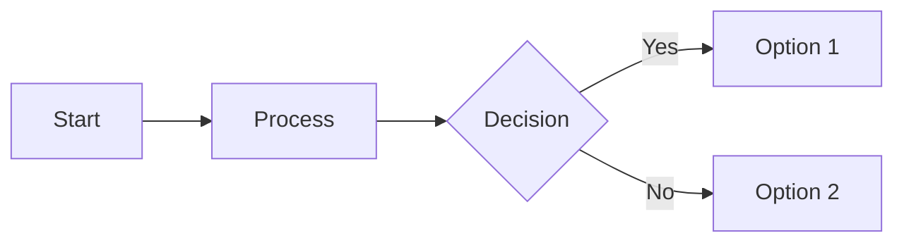
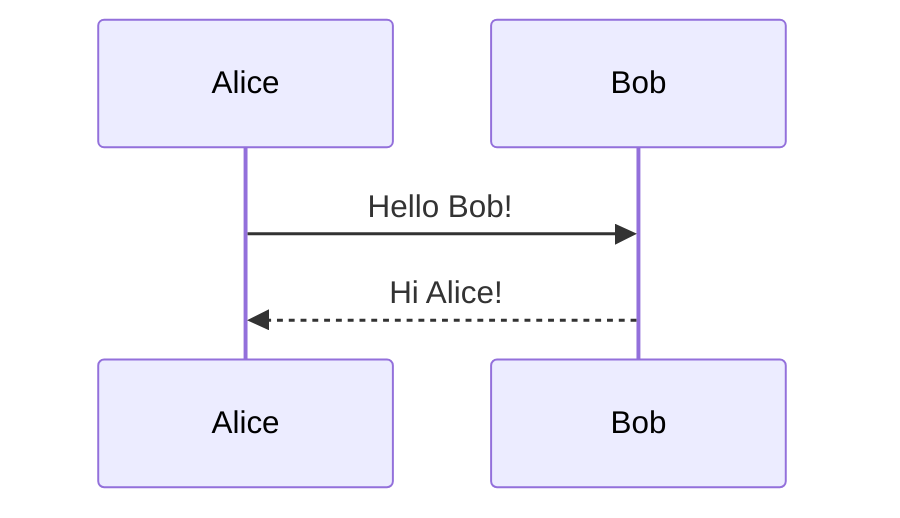

# Obsidian Flavored Markdown (OFM) - Complete Syntax Guide

## Overview

Obsidian Flavored Markdown (OFM) extends CommonMark and GitHub Flavored Markdown with wiki-inspired features for knowledge management. All notes are stored as plain `.md` files for portability.

**Official Documentation**: https://help.obsidian.md/Editing+and+formatting/Obsidian+Flavored+Markdown

## Internal Linking (Wikilinks)

### Basic Wikilinks

```markdown
[[Note Name]]                    # Link to note
[[Note Name|Display Text]]       # Custom display text
[[Note#Heading]]                 # Link to specific heading
[[Note#^block-id]]               # Link to specific block
```

### Block References

Add `^block-id` at the end of any line to create a referenceable block:

```markdown
This is a paragraph with a block reference. ^my-block-id

- List item with reference ^list-item-ref
```

Link to blocks:

```markdown
[[Note#^my-block-id]]           # Link to specific block
![[Note#^my-block-id]]          # Embed specific block
```

Auto-generated block IDs: Use `[[^^` to trigger autocomplete for automatic ID generation.

## Embeds (Transclusion)

Use `!` prefix before wikilink to embed content:

```markdown
![[Note]]                        # Embed entire note
![[Note#Heading]]                # Embed from heading onwards
![[Note#^block-id]]              # Embed specific block
![[Image.jpg]]                   # Embed image
![[Video.mp4]]                   # Embed video
![[Audio.mp3]]                   # Embed audio
![[Document.pdf]]                # Embed PDF
```

**Key Feature**: Embedded content stays synchronized with source - updating the original automatically updates all embeds.

## Callouts (Admonitions)

### Basic Syntax

```markdown
> [!type] Optional Title
> Body content here
> Can span multiple lines
```

### Available Types

**Blue**: note, info, todo
**Cyan**: tip, hint, important
**Green**: abstract, summary, tldr, success, check, done
**Yellow**: question, help, faq
**Orange**: warning, caution, attention
**Red**: failure, fail, missing, danger, error, bug
**Purple**: example
**Grey**: quote, cite

### Examples

```markdown
> [!note]
> This is a note callout

> [!warning] Watch Out!
> This is important information

> [!example]- Click to Expand
> This callout is collapsed by default
```

### Collapsible Callouts

```markdown
> [!tip]+                        # Defaults to expanded
> Content here

> [!tip]-                        # Defaults to collapsed
> Content here
```

## Tags

### Basic Tags

```markdown
#tag                             # Basic tag (no spaces)
#multi-word-tag                  # Use hyphens for spaces
```

### Nested Tags

```markdown
#parent/child/grandchild         # Unlimited hierarchy
```

**Behavior**: Searching `#parent` matches all `#parent/child` tags

### Tag Locations

Tags can appear:
- Anywhere in note body
- In frontmatter as YAML list

```yaml
---
tags: [tag1, tag2, parent/child]
---
```

## Comments

### Obsidian-Specific Comments

```markdown
%% This is a comment %%
%%
Multi-line
comment
%%
```

**Note**: Hidden in preview/reading mode, but **not portable** to other markdown processors.

### Portable HTML Comments

```markdown
<!-- This is a portable comment -->
```

Use HTML comments for portability across different markdown renderers.

## Highlights

```markdown
==highlighted text==
```

**Compatibility**: Obsidian-specific syntax, not supported by most markdown processors. For portability, use HTML `<mark>` tags:

```markdown
<mark>highlighted text</mark>
```

## Properties/Frontmatter

### Basic YAML Frontmatter

```yaml
---
title: Note Title
created: 2025-11-12
modified: 2025-11-12
tags: [tag1, tag2]
author: Name
status: active
---
```

### Six Property Types (Obsidian 1.4.0+)

1. **Text** - Simple strings, URLs, or `[[wikilinks]]`
2. **List** - Multiple text items (like tags array)
3. **Number** - Integers or decimals only
4. **Checkbox** - Boolean true/false
5. **Date** - Calendar dates (ISO 8601 format: YYYY-MM-DD)
6. **DateTime** - Date with 12-hour time

### Special Built-in Properties

```yaml
---
tags: [taxonomy, classification]      # For taxonomy
aliases: [Alternative Name, Alias]    # Alternative note names
cssclasses: [custom-class]            # Custom CSS styling
---
```

### Wikilinks in Frontmatter

```yaml
---
related: "[[Related Note]]"
project: "[[Projects/My Project]]"
---
```

## Math (LaTeX)

### Inline Math

```markdown
The equation $E = mc^2$ is inline.
Use $\sum_{i=1}^{n} x_i$ for summations.
```

### Display Math

```markdown
$$
\int_{0}^{\infty} e^{-x^2} dx = \frac{\sqrt{\pi}}{2}
$$

$$
\begin{bmatrix}
a & b \\
c & d
\end{bmatrix}
$$
```

**Rendering**: Native MathJax support (JavaScript library for LaTeX rendering)

## Diagrams (Mermaid)

### Flowcharts

````markdown

````

**Orientations**: LR (left-right), TB (top-bottom), RL (right-left), BT (bottom-top)

### Sequence Diagrams

````markdown

````

### Other Diagram Types

- Class diagrams
- State diagrams
- Gantt charts
- Pie charts
- Git graphs
- Entity relationship diagrams

**Testing**: Use Mermaid Live Editor (https://mermaid.live) for syntax validation

## Dataview Plugin Queries

### Query Types

**LIST** - Bullet-point lists:
````markdown
```dataview
LIST
FROM #project
WHERE status = "active"
```
````

**TABLE** - Tabular data with columns:
````markdown
```dataview
TABLE rating, author, date
FROM #books
SORT rating DESC
```
````

**TASK** - Interactive task lists:
````markdown
```dataview
TASK
WHERE due < date(today)
AND !completed
```
````

**CALENDAR** - Monthly calendar view:
````markdown
```dataview
CALENDAR due
WHERE typeof(due) = "date"
```
````

### Inline Fields (Dataview Metadata)

**Frontmatter**:
```yaml
---
rating: 8
reviewed: 2025-11-12
---
```

**Inline Fields**:
```markdown
Basic Field:: Some Value
This is [rating:: 9] inline!
- [ ] Task [due:: 2025-12-01]
```

### Data Commands

- `FROM` - Source specification (tags, folders)
- `WHERE` - Filter by conditions
- `SORT` - Order results
- `GROUP BY` - Consolidate rows
- `LIMIT` - Restrict count
- `FLATTEN` - Expand arrays

**Official Documentation**: https://blacksmithgu.github.io/obsidian-dataview/

## Standard Markdown Features

### Headings

```markdown
# Heading 1
## Heading 2
### Heading 3
#### Heading 4
##### Heading 5
###### Heading 6
```

### Text Formatting

```markdown
**bold text**
*italic text*
***bold and italic***
~~strikethrough~~
`inline code`
```

### Lists

**Unordered**:
```markdown
- Item 1
- Item 2
  - Nested item
```

**Ordered**:
```markdown
1. First item
2. Second item
   1. Nested item
```

**Task Lists**:
```markdown
- [ ] Unchecked task
- [x] Checked task
```

### Links

```markdown
[Link Text](https://example.com)
[Link with title](https://example.com "Title")
```

### Images

```markdown


```

### Code Blocks

````markdown
```python
def hello():
    print("Hello, World!")
```
````

### Blockquotes

```markdown
> This is a blockquote
> It can span multiple lines
```

### Horizontal Rules

```markdown
---
***
___
```

### Tables

```markdown
| Header 1 | Header 2 | Header 3 |
|----------|----------|----------|
| Cell 1   | Cell 2   | Cell 3   |
| Cell 4   | Cell 5   | Cell 6   |
```

**Alignment**:
```markdown
| Left | Center | Right |
|:-----|:------:|------:|
| L1   |   C1   |    R1 |
```

### Footnotes

```markdown
Here's a sentence with a footnote.[^1]

[^1]: This is the footnote content.
```

## Template Variables (Templates Core Plugin)

```markdown
{{title}}       # Note title
{{date}}        # Current date
{{time}}        # Current time
```

## Query Blocks (Search within Notes)

````markdown
```query
#tag +keyword
```
````

## Compatibility Notes

### Portable to Other Markdown Processors

- Standard markdown formatting
- HTML comments
- HTML tags (`<mark>`, `<sub>`, `<sup>`)
- Standard links `[text](url)`

### Obsidian-Specific (Not Portable)

- Wikilinks `[[note]]`
- Embeds `![[note]]`
- Comments `%% comment %%`
- Highlights `==text==`
- Callouts `> [!type]`
- Block references `^block-id`
- Dataview queries
- Mermaid diagrams (limited support)

### Converting for Export

Use **obsidian-export** CLI to convert OFM to standard markdown:

```bash
obsidian-export /path/to/vault /path/to/output/
```

This converts wikilinks to standard links and maintains compatibility.

## Best Practices

1. **Use wikilinks for internal connections** - Faster and more natural
2. **Add block IDs for important paragraphs** - Enable precise references
3. **Use callouts for important information** - Visual hierarchy
4. **Leverage frontmatter for metadata** - Enable queries and organization
5. **Nest tags logically** - Create meaningful hierarchies
6. **Use portable syntax when exporting** - Consider future migration
7. **Test mermaid diagrams in live editor** - Catch syntax errors early
8. **Keep frontmatter consistent** - Use same fields across similar notes

## Additional Resources

- **Official Obsidian Help**: https://help.obsidian.md
- **Dataview Documentation**: https://blacksmithgu.github.io/obsidian-dataview/
- **Mermaid Documentation**: https://mermaid.js.org/
- **CommonMark Spec**: https://commonmark.org/
- **Markdown Guide - Obsidian**: https://www.markdownguide.org/tools/obsidian/